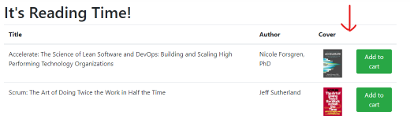

# Lab 1.1 - Planning our Work with Issues

Whether you're a sales-driven "waterfall" org or an agile team practicing Scrum or Kanban, it's important to effectively plan and track the work your team and organisation perform. You also need effective ways to communicate, both within your team and organisation, but also with your communities.

In this lab, you'll work with GitHub Issues to plan and manage some of the work we'll be completing in the remainder of this Workshop.

## Exercise 1 - Creating and working with Issues

Let's create some Issues! 📃

1. Navigate to the `Issues` tab in your repository
2. Click the green `New issue` button
3. Type `Add book ratings` as the title
4. Type `Add a book rating column to the book list` in the description
5. Add an image to the description
    

        - To add an image, you can paste from the clipboard, drag an image file into the browser, or click the bar at the bottom of the text area.
        - For this Issue, use the following image:
        
        
    

Add an image into the description. You can paste from the clipboard, drag an image file into the browser, or click the bar at the bottom of the text area.
Add a task list using the checkbox icon at the top of the text area . Add two tasks - one to change the background color in the stylesheet, and another to change the border color on the images.
Assign yourself in the Assignees section on the right
Add an appropriate label in the Labels section using the cog icon.
Add this issue to a new Milestone using the cog in the Milestones area and typing a new name to create.
Change to the Preview tab to ensure it looks the way you want.
Save the Issue.
At this point, you have an issue that represents this piece of work. But there are a few more things we can do.

Hover over one of the tasks in your task list, and click the circular create issue icon icon to the right to convert this task to an issue.
Click the link to the new issue and see that it's being tracked by Issue #1. Click the link to go back to its parent.
Leave a new comment about this issue at the bottom. Use the @ character to reference someone (maybe your proctor), and the # character to reference another issue.